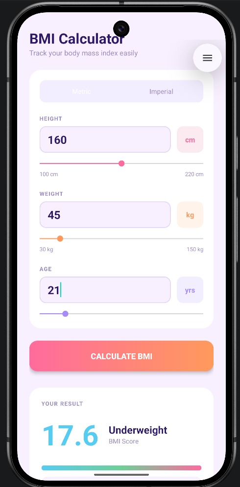
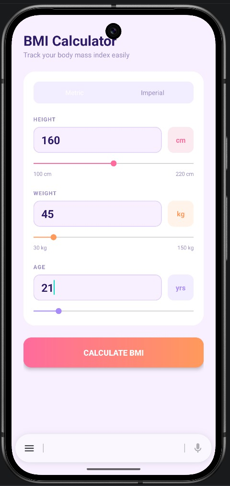

# BMI Calculator App 📱

Aplikasi penghitung Body Mass Index (BMI) sederhana dengan tampilan modern dan interaktif. Dibuat menggunakan Kotlin untuk Android.

## Fitur Utama
- ✨ Hitung BMI secara real-time.
- 🔄 Dukungan satuan Metrik (cm/kg) dan Imperial (in/lbs).
- 🎚️ Sinkronisasi antara Slider (SeekBar) dan Kotak Input (EditText).
- 📊 Interpretasi hasil BMI disertai tips kesehatan.
- 🎨 UI modern dengan gradasi warna.

## Tampilan Aplikasi
Berikut adalah screenshot dari aplikasi BMI Calculator:

| Input Page | Result Page |
|:---:|:---:|
|  |  |

## Cara Penggunaan
1. Pilih satuan yang ingin digunakan (Metric atau Imperial).
2. Geser slider atau ketik langsung tinggi badan, berat badan, dan umur kamu.
3. Klik tombol **Calculate BMI**.
4. Hasil skor BMI, kategori, dan tips akan muncul di bagian bawah.

---
*Dibuat untuk keperluan belajar pengembangan aplikasi Android.*
